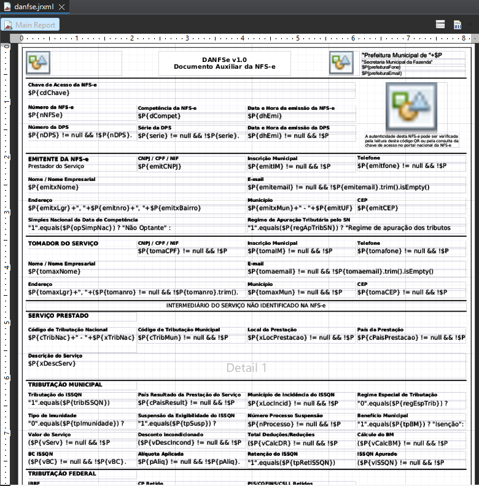

# NFSe Nacional - XML para PDF

## 📌 Descrição
Este projeto tem como objetivo gerar relatório PDF da Nota Fiscal de Serviço Eletrônica no padrão nacional.
Recebe como parâmetro, a descrição de cada campo do XML de retorno de geração da DPS > NFSe

## 🛠️ Tecnologias
- Java
- Jaspersoft Studio 6.21.5

## 📷 Screenshots
